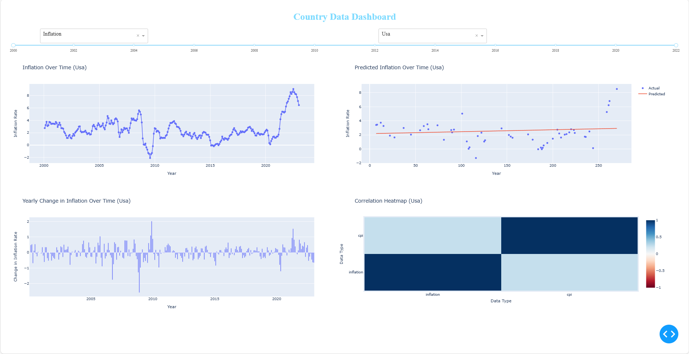

# Country Data Dashboard

This project is a data dashboard that allows you to explore different types of data for various countries. It uses data from the Quandl API and presents it in a user-friendly format using Dash and Plotly. The dashboard includes several interactive components such as dropdowns and sliders that allow you to filter the data, and it displays the data in various types of charts including line charts, bar charts, and a heatmap.

## Installation

To install the necessary dependencies for this project, you can use pip:

```bash
pip install -r requirements.txt
```

This will install all the necessary Python packages for this project.

## Configuration

Before running the project, you need to add your Quandl API key. Here's how you can do it:

1. Open the `config.py` file in a text editor.
2. Replace `'your-api-key'` with your actual Quandl API key.
3. Save and close the file.

Please note that you should never share your `config.py` file with anyone else, as it contains sensitive information.

## Usage

To run the project, you can use the following command:

```bash
python main.py
```

This will start the Dash server and you can view the dashboard by opening a web browser and navigating to `http://127.0.0.1:8050`.

## Screenshots



We hope you find this project useful and we welcome any feedback or contributions!
